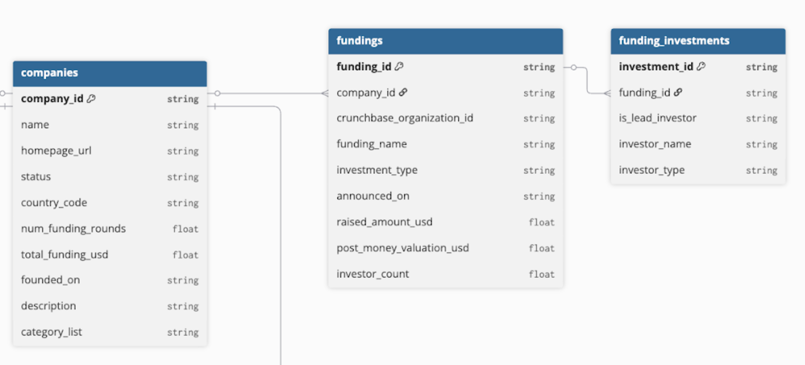

# ENSAE Applied Stats Challenge - Introduction to the Data

## Overview

This document provides a comprehensive guide to the datasets provided for the **Predicting Startup Trajectories Using Heterogeneous Data** challenge. The data includes information on **27,843 startup companies** tracked across multiple dimensions including funding history, and investor networks.

The data spans multiple years and provides both **cross-sectional** (static company attributes) and **longitudinal** (time-series) information, enabling sophisticated predictive modeling of startup outcomes.

---

## Background on Venture Capital

### What is Venture Capital?

**Venture Capital (VC)** is a form of financing provided to early-stage, high-potential startups in exchange for equity (ownership stake). Unlike traditional loans, VC investors take on significant risk by investing in unproven companies, with the expectation that a small number of successful investments will generate returns large enough to compensate for the many that fail.

### Funding Stages

Startups typically raise capital in sequential rounds, each serving different purposes as the company matures:

**1. Pre-Seed**

- **Timing:** Idea or prototype stage
- **Amount:** around €50K - €500K (not fixed)
- **Purpose:** Initial product development, market validation
- **Investors:** Founders, friends & family, angel investors, early-stage funds

**2. Seed**

- **Timing:** Early product, initial traction
- **Amount:** around €500K - €3M (not fixed)
- **Purpose:** Product-market fit, early customer acquisition
- **Investors:** Angel investors, seed funds, accelerators

**3. Series A**

- **Timing:** Proven business model with recurring revenue
- **Amount:** around €3M - €15M (not fixed)
- **Purpose:** Scaling operations, growing team, market expansion
- **Investors:** Traditional VC funds

**4. Series B**

- **Timing:** Established market position, rapid growth phase
- **Amount:** around €15M - €50M (not fixed)
- **Purpose:** Scaling to new markets, significant team expansion
- **Investors:** Larger VC funds, growth equity funds

And so on, up to Series C, D, E and sometimes further. The final goal for the VC is an exit event (i.e. an acquisition or IPO).

### About Red River West

Our company has two distinct operatings funds, each with a different investment thesis and strategy:

#### **Fund 1: Red River West**

A Series A/B fund focused on European technology companies.

**Investment Strategy:**

- **Geography:** European Union only
- **Stage:** Series A and Series B rounds
- **Sector:** Sector-agnostic (all industries)
- **Company Age:** Founded after January 1, 2008
- **Status:** Must be actively operating
- **Funding Range:**
  - French companies: €500K - €1B total funding raised
  - Other EU companies: €5M - €1B total funding raised

**Characteristics:** This fund targets proven companies with established business models and revenue, seeking to help them scale across Europe.

#### **Fund 2: >commit**

A specialized early-stage fund focused on open-source technology companies.

**Investment Strategy:**

- **Geography:** EU, United States, Canada, Norway, Israel, United Kingdom
- **Stage:** Pre-seed and Seed rounds
- **Sector:** Open Source technology
- **Technical Requirements:** Must have active presence on:
  - GitHub (public repositories)
  - Hugging Face
  - Other significant open-source platforms

**Characteristics:** This fund targets developer-first companies building open-source infrastructure, tools, and platforms at the earliest stages of development.

### Dataset Universe

The 27,843 companies in this dataset represent the **combined investment universe** of both funds. This means:

- Some companies are **Series A/B stage** European tech companies (Red River West fund)
- Others are **early-stage open-source** companies across broader geographies (>commit fund)
- Companies may "graduate" from >commit to Red River West as they mature
- The mix of stages and sectors provides rich variation for predictive modeling

Understanding these distinct investment strategies will help you interpret patterns in the data (e.g., why certain companies have GitHub activity, why geographic distribution varies, etc.).

---

## Dataset Architecture

The data is organized around a **star schema** with the **Companies table** at the center, connected to six related datasets.

---

## 1. Companies Dataset 🏢

**File:** `companies.csv`  
**Rows:** 27,843  
**Purpose:** Main reference table containing fundamental information about each startup.

### Schema

| Column               | Type   | Description                                        |
| -------------------- | ------ | -------------------------------------------------- |
| `company_id`         | string | Unique identifier (UUID format)                    |
| `name`               | string | Company name                                       |
| `homepage_url`       | string | Company website URL                                |
| `status`             | string | Current company status (operating/acquired/closed) |
| `country_code`       | string | ISO country code (e.g., 'US', 'GB')                |
| `num_funding_rounds` | float  | Total number of funding rounds raised              |
| `total_funding_usd`  | float  | Total amount raised in USD                         |
| `founded_on`         | string | Foundation date (YYYY-MM-DD format)                |
| `description`        | string | Company description (textual)                      |
| `category_list`      | string | Industry categories (JSON format)                  |

### Key Insights

- **Coverage:** Comprehensive coverage across all companies
- **Funding Data:** ~54% of companies have funding information
- **Text Data:** Rich textual information in `description` field (avg. length varies)
- **Categories:** 19,344 unique category combinations, most common being `{Software}` (426 companies)

### Example Use Cases

- **Feature engineering:** Use `founded_on` to calculate company age at prediction time
- **Text analysis:** Extract signals from company descriptions using NLP
- **Industry clustering:** Parse `category_list` to identify sector-specific patterns

---

## 2. Fundings Dataset 💰

**File:** `fundings.csv`  
**Rows:** 35,854  
**Relationship:** Many-to-one with Companies (via `company_id`)

### Schema

| Column                       | Type   | Description                           |
| ---------------------------- | ------ | ------------------------------------- |
| `crunchbase_organization_id` | string | Crunchbase identifier                 |
| `company_id`                 | string | **Foreign key** to Companies          |
| `funding_id`                 | string | Unique funding round identifier       |
| `funding_name`               | string | Round name (e.g., "Series A", "Seed") |
| `investment_type`            | string | Type of investment round              |
| `announced_on`               | string | Date announced (YYYY-MM-DD)           |
| `raised_amount_usd`          | float  | Amount raised in USD                  |
| `post_money_valuation_usd`   | float  | Post-money valuation                  |
| `investor_count`             | float  | Number of investors in round          |

### Key Insights

- **Coverage:** 13,481 companies have funding data (48.4% of total)
- **Multiple Rounds:** Many companies have multiple funding rounds (avg ~2.7 rounds per funded company)
- **Valuation Data:** Very sparse (only 7.6% have valuation data)
- **Investor Count:** Available for 87.4% of funding rounds (mean: 3.6 investors)

### Example Use Cases

- **Temporal features:** Time between funding rounds
- **Momentum indicators:** Acceleration/deceleration in funding amounts
- **Success prediction:** Companies that raised Series A → predict Series B
- **Valuation modeling:** Predict post-money valuation (when available)

---

## 3. Funding Investments Dataset 🤝

**File:** `funding_investments.csv`  
**Rows:** 113,448  
**Relationship:** Many-to-one with Fundings (via `funding_id`)

### Schema

| Column             | Type   | Description                      |
| ------------------ | ------ | -------------------------------- |
| `investment_id`    | string | Unique investment identifier     |
| `funding_id`       | string | **Foreign key** to Fundings      |
| `is_lead_investor` | string | Whether investor led the round   |
| `investor_name`    | string | Name of investor                 |
| `investor_type`    | string | Type: "organization" or "person" |

### Key Insights

- **Granularity:** Individual investments within funding rounds
- **Investor Networks:** 30,958 funding rounds with detailed investor data
- **Lead Information:** Limited data on lead investors (35% coverage)
- **Investor Types:** 82.7% are organizations, 17.3% are individuals

### Example Use Cases

- **Network analysis:** Build investor co-investment networks
- **Syndicate patterns:** Analyze investor combinations that predict success
- **Signal strength:** Presence of top-tier investors as predictive feature

## Data Relationships Summary

### Primary Keys and Foreign Keys

```
Companies.company_id (PRIMARY KEY)
    ↓
    ├── Fundings.company_id (FOREIGN KEY)
    │       ↓
    │       └── Funding_Investments.funding_id (FOREIGN KEY)
    │
```


